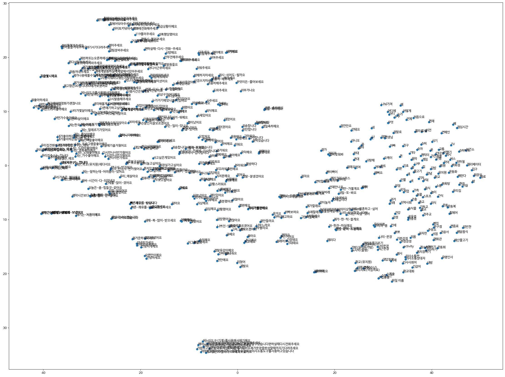

# <center>Say Better-ML Repo</center>

<br>
<p align="center">

</p>

<h1 align="center">Say Better</h1>

<br>

## Abstract

In this repository, we created a word card recommendation system using the text bison (PaLM2) model and embeddings from SBERT, a pre-trained model.


The goal is to make it easier for educators to find words that fit the situation as educators are recommended word cards that fit the situation.

## File-Tree

```
📦Say_Better_ML
 ┣ 📂image
 ┃ ┣ 📜Say-Better_logo1.png
 ┃ ┣ 📜Say_Better-System-Architecture.drawio.png
 ┃ ┣ 📜say_better_embedding_graph2d.png
 ┃ ┗ 📜say_better_embedding_graph3d.png
 ┣ 📂recommender
 ┃ ┣ 📜create_relate_word.py
 ┃ ┗ 📜recommend_word_card.py
 ┣ 📜KAAC_basic.csv
 ┣ 📜main.py
 ┣ 📜README.md
 ┣ 📜requirements.txt
 ┣ 📜wise-imagery-410607-249d947f56fd.json
 ┗ 📜word_card_embed.npy
```

## System Architecture


<center></center>

**Preprocessing**


- Since the word card had a lot of StopWords and no spaces, the pre-processing process removed the StopWord and put spaces using the bison (text) model.


- I vectorized word cards using SBERT


**Operation**

- The user enters the situation.

- The Cloud Function receives input and communicates the situation to Vertex AI.

- Vertex AI returns 10 keywords to Cloud Function.

- We calculate the cosine similarity of keywords vectorized by Cloud Funciton with 543 word card vectors.

- Add to the list the top three word cards with the highest cosine similarity per keyword.

- Cloud Function returns a total of 30 word cards.


---------------------------

The codebase is developed with *Python 3.10.12*. After creating an environment install the requirements as
follows:

```
pip install -r requirements.txt
```

## Pre-Trained Models

**We used a hugging face pre-learning model, kykim/vert-kor-base.** 
Loading the pre-trained models is as easy as running the following code piece:

```
from transformers import BertTokenizer, TFBertModel

model_id = 'kykim/bert-kor-base'
tokenizer = BertTokenizer.from_pretrained(model_id)
model = TFBertModel.from_pretrained(model_id)
```
 
## Model-Embedding

This graph shows the embedding vector values of the word card.





**Click on the image to zoom in.**


It can be seen that word cards with similar meanings are gathered together.

## Vertex API_\<model\>_\<dataset\>

The text bison (PaLM2) model was used for keyword extraction.


The kykim/vert-kor-base model was used for sentence similarity analysis.


The word cards used were brought by KAAC with copyright permission, and 542 word cards were used.


### References
--------------

#### Link
[Sentence-BERT: Sentence Embeddings using Siamese BERT-Networks](https://arxiv.org/pdf/1908.10084.pdf)  

[Google Cloud Function Overview](https://cloud.google.com/functions/docs/concepts/overview?hl=ko)

[Vertex AI Overview](https://cloud.google.com/vertex-ai/docs/start/introduction-unified-platform?hl=ko)


### Team github pages

---------------------------


SayBetter-TeamDoc: 

(1) https://github.com/Say-Better/Team-Docs

SayBetter-Server: 

(1) https://github.com/jimmy0006/hearsitter-server-python


SayBetter-Front:

(1) https://github.com/Say-Better/Android


